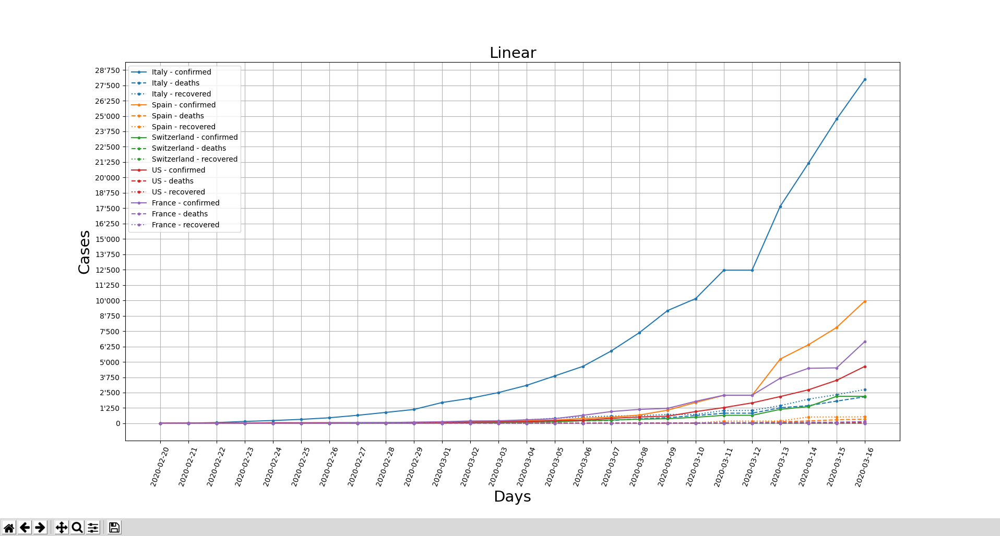
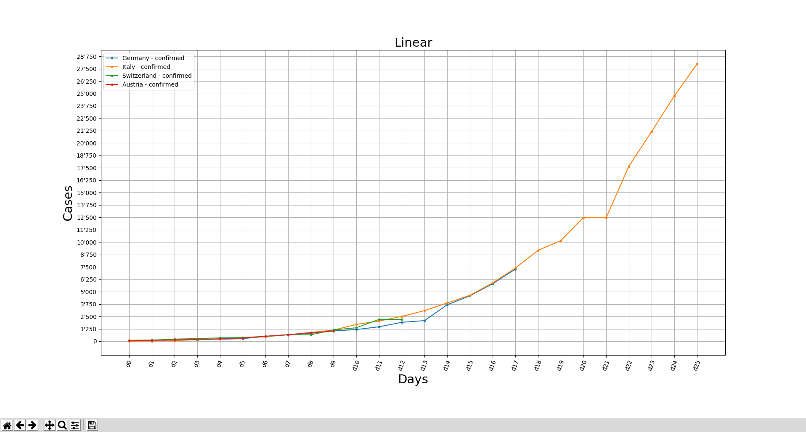
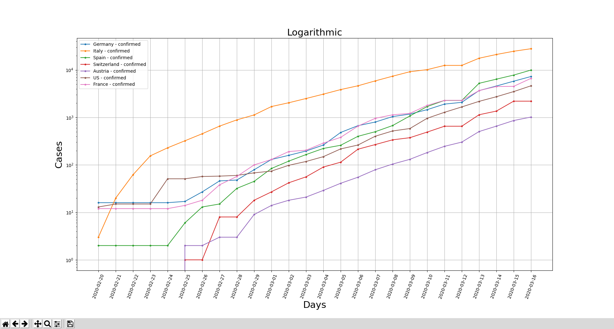
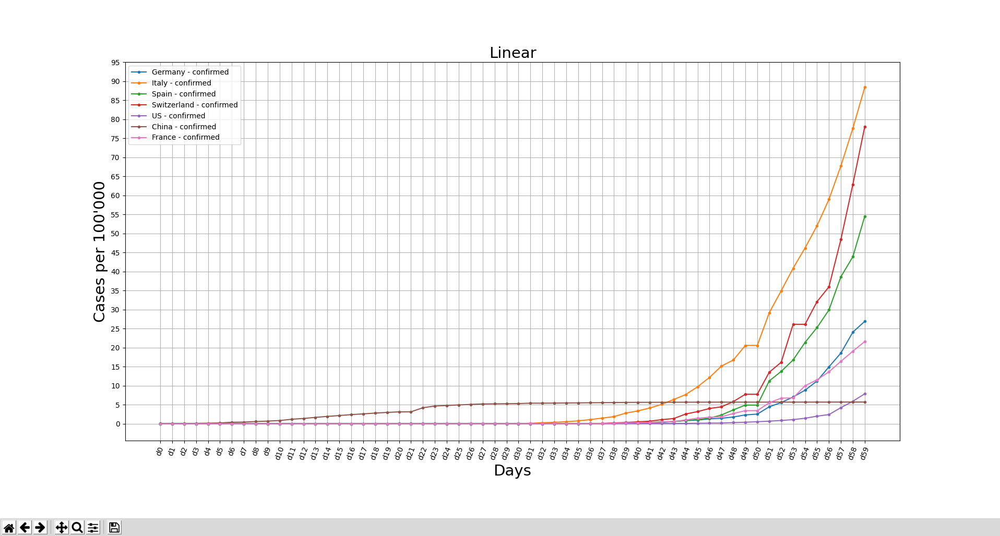
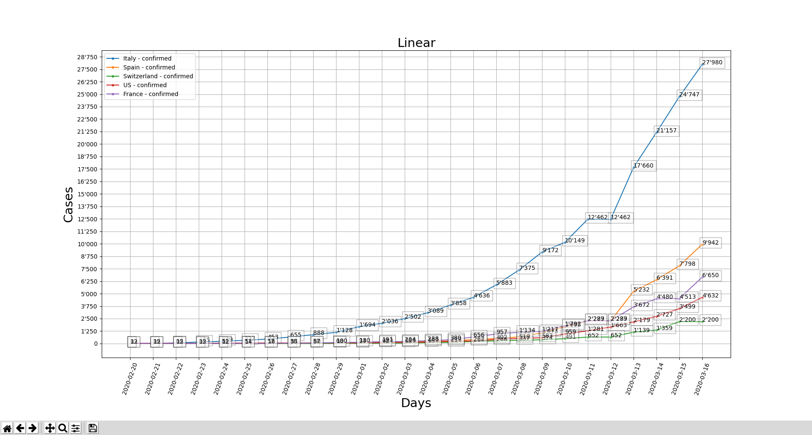

# covid_19_plot.py

Quick and dirty plotting tool for Covid-19 (SARS-CoV-2) data.

## Warning

I've just hacked this together real quick, because I wanted something like this. Maybe
it's interesting for someone else.

Don't rely on this tool for anything!

## Prerequisites

This tool uses the data repository for the 2019 Novel Coronavirus Visual Dashboard
operated by the Johns Hopkins University Center for Systems Science and Engineering
(JHU CSSE).

Clone [the Covid-19 data](https://github.com/CSSEGISandData/COVID-19) into the same directory
as `covid_19_graph.py`:

```shell
cd /path/to/covid-19-plot
git clone git@github.com:CSSEGISandData/COVID-19.git
```

Install `matplotlib`:

```
pip install matplotlib
```

Maybe you also need to install your preferred
[backend for matplotlib](https://matplotlib.org/faq/usage_faq.html#what-is-a-backend).

For example:

```
pip install PyQt5
```

## Usage

```
usage: covid_19_plot.py [-h] [-l] [-c] [-d] [-r] [-a] [-s STARTDATE] [-m] [--annotate] [--split-by-state] [--list-countries] [countries [countries ...]]

positional arguments:
  countries             List of countries/regions (defaults to Switzerland)

optional arguments:
  -h, --help            show this help message and exit
  -l, --logarithmic     use logarithmic scale
  -c, --confirmed       include confirmed (default)
  -d, --deaths          include deaths
  -r, --recovered       include recovered
  -a, --all             include all
  -s STARTDATE, --startdate STARTDATE
                        plot data past given date - format YYYY-MM-DD
  -m, --compare         match x-axis of multiple countries (matches by closest data point to 1000)
  --annotate            add annotation to data points
  --split-by-state      show graph for each province/state
  --list-countries      list available countries/regions
```

## Examples

```shell
./covid_19_plot.py --all --startdate 2020-02-20 Switzerland Italy Spain France US
```




```shell
./covid_19_plot.py --compare --startdate 2020-02-20 Italy Switzerland Austria Germany
```



```shell
./covid_19_plot.py --startdate 2020-02-20 --logarithmic Italy Switzerland Austria Germany US France Spain
```



```shell
./covid_19_plot.py --annotate --startdate 2020-02-20 Switzerland Italy Spain France US
```



```shell
./covid_19_plot.py --split-by-state Australia Switzerland
```


